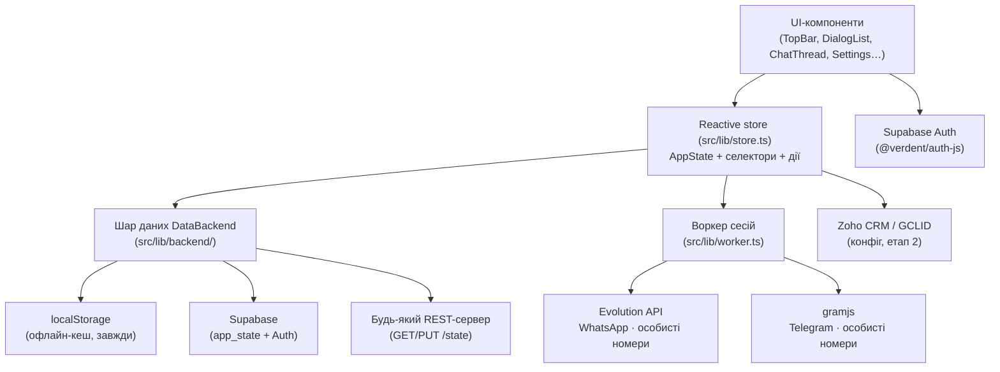

# Архітектура LocalChats · Sales Console

## Загальна схема

## Шари та принципи

| Шар | Файли | Відповідальність |
|---|---|---|
| UI | `src/components/*`, `src/App.tsx` | Екрани консолі: інбокс, чат, канали, ліди, аналітика, адмінка, налаштування. Жодної прямої роботи зі сховищами. |
| Стан | `src/lib/store.ts` | Єдине джерело правди `AppState`: співробітники, канали, діалоги, повідомлення, кліки/атрібуція, фільтри, пейринг. Реактивність через `useSyncExternalStore`. |
| Шар даних | `src/lib/backend/*` | Підключна архітектура зберігання (див. [backend-adapters.md](backend-adapters.md)). Store залежить лише від інтерфейсу `DataBackend`. |
| Воркер сесій | `src/lib/worker.ts` | REST-клієнт Evolution API (WhatsApp) і gramjs-воркера (Telegram): створення інстансів, QR-пейринг, статуси, надсилання повідомлень. |
| Конфігурація | `src/lib/connections.ts` | Режим (демо/прод), воркер, Zoho, архітектура даних, статуси перевірок. Зберігається в `localStorage` (`localchats_connections_v1`). |
| Атрібуція | `src/lib/attribution.ts`, `src/lib/gclidExport.ts` | Розбір `#міток`, fallback-матчинг за недавнім кліком, експорт CSV для Google Ads. |
| Схема БД | `supabase/schema.sql` | Повна схема етапу 2: profiles, channels, conversations, messages, clicks, leads, pairing_sessions, app_state + RLS. |

## Ключові потоки

### 1. Вхідне повідомлення (прод)
Месенджер → воркер сесій → (етап 2: вебхук → ingest у БД) → Realtime/стан → інбокс.
У демо-режимі вхідні генерує симулятор (`simulateIncoming`): сценарії `exact` (мітка в тексті),
`fallback` (клик був нещодавно, мітки немає), `direct`.

### 2. QR-пейринг номера
`startPairing('wa' | 'tg')` → у проді: `createInstance` → `connectInstance` (QR-зображення + pairing code)
→ опитування статусу кожні 3 с (покоління `pairingSeq` скасовує застарілі цикли) → `finishRealPairing`
створює канал. Будь-який вихід із циклу (stale, скасування, помилка, таймаут) робить `logoutInstance` —
«жива» WA-сесія на воркері не залишається. Escape/клік по фону скасовують пейринг
(`useEscapeToClose`).

### 3. Відповідь на вхідне
Композер надсилає лише відповідь на діалог (inbound-only, розсилок немає за побудовою):
WA — `POST /message/sendText/{instance}`, TG — `POST /tg/send` з нормалізованим чатом
(`@handle` або цифровий ID). У демо — імітація статусів delivered/read.

## Режими роботи

- **Демо** (`mode: 'demo'`): все локально, QR симулюється, вхідні — симулятор. Потрібен для тестів інтерфейсу.
- **Прод** (`mode: 'production'` + воркер відповів `ok`): реальні QR-сесії, реальне надсилання, heartbeat статусів каналів раз на 60 с.

## Безпека

- Секрети (API-ключі воркера, Zoho) не зберігаються в коді — лише в конфігу користувача/змінних оточення.
- **Конфіг з'єднань у `localStorage` зберігається у відкритому вигляді** і доступний будь-якому
  XSS-скрипту: вводьте лише ключі, якими володіє користувач (деталі — [backend-adapters.md](backend-adapters.md), розділ «Безпека: зберігання ключів»).
- `service_role`-ключі Supabase у браузер не потрапляють; RLS у `schema.sql` обмежує доступ (`auth.uid()`).
- Сесії месенджерів (Baileys creds / StringSession) у проді шифруються на воркері (етап 2).
- Політика **inbound-only** — головний механізм зниження ризику банів номерів.
