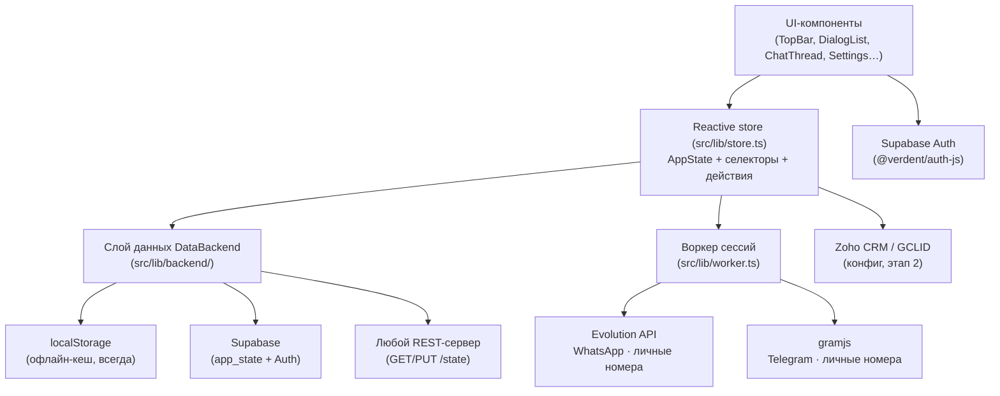

# Архитектура LocalChats · Sales Console

## Общая схема

## Слои и принципы

| Слой | Файлы | Ответственность |
|---|---|---|
| UI | `src/components/*`, `src/App.tsx` | Экраны консоли: инбокс, чат, каналы, лиды, аналитика, админка, настройки. Никакой прямой работы с хранилищами. |
| Состояние | `src/lib/store.ts` | Единственный источник правды `AppState`: сотрудники, каналы, диалоги, сообщения, клики/атрибуция, фильтры, пейринг. Реактивность через `useSyncExternalStore`. |
| Слой данных | `src/lib/backend/*` | Подключаемая архитектура хранения (см. [backend-adapters.md](backend-adapters.md)). Store зависит только от интерфейса `DataBackend`. |
| Воркер сессий | `src/lib/worker.ts` | REST-клиент Evolution API (WhatsApp) и gramjs-воркера (Telegram): создание инстансов, QR-пейринг, статусы, отправка сообщений. |
| Конфигурация | `src/lib/connections.ts` | Режим (демо/прод), воркер, Zoho, архитектура данных, статусы проверок. Хранится в `localStorage` (`localchats_connections_v1`). |
| Атрибуция | `src/lib/attribution.ts`, `src/lib/gclidExport.ts` | Разбор `#меток`, fallback-матчинг по недавнему клику, экспорт CSV для Google Ads. |
| Схема БД | `supabase/schema.sql` | Полная схема этапа 2: profiles, channels, conversations, messages, clicks, leads, pairing_sessions, app_state + RLS. |

## Ключевые потоки

### 1. Входящее сообщение (прод)
Мессенджер → воркер сессий → (этап 2: вебхук → ingest в БД) → Realtime/состояние → инбокс.
В демо-режиме входящие генерирует симулятор (`simulateIncoming`): сценарии `exact` (метка в тексте),
`fallback` (клик был недавно, метки нет), `direct`.

### 2. QR-пейринг номера
`startPairing('wa' | 'tg')` → в проде: `createInstance` → `connectInstance` (QR-изображение + pairing code)
→ опрос статуса каждые 3 с (поколение `pairingSeq` отменяет устаревшие циклы) → `finishRealPairing`
создаёт канал. Любой выход из цикла (stale, отмена, ошибка, таймаут) делает `logoutInstance` —
«живая» WA-сессия на воркере не остаётся. Escape/клик по фону отменяют пейринг
(`useEscapeToClose`).

### 3. Ответ на входящее
Композер отправляет только ответ на диалог (inbound-only, рассылок нет по построению):
WA — `POST /message/sendText/{instance}`, TG — `POST /tg/send` с нормализованным чатом
(`@handle` или цифровой ID). В демо — имитация статусов delivered/read.

## Режимы работы

- **Демо** (`mode: 'demo'`): всё локально, QR симулируется, входящие — симулятор. Нужен для тестов интерфейса.
- **Прод** (`mode: 'production'` + воркер ответил `ok`): реальные QR-сессии, реальная отправка, heartbeat статусов каналов раз в 60 с.

## Безопасность

- Секреты (API-ключи воркера, Zoho) не хранятся в коде — только в конфиге пользователя/переменных окружения.
- `service_role`-ключи Supabase в браузер не попадают; RLS в `schema.sql` ограничивает доступ (`auth.uid()`).
- Сессии мессенджеров (Baileys creds / StringSession) в проде шифруются на воркере (этап 2).
- Политика **inbound-only** — главный механизм снижения риска банов номеров.
